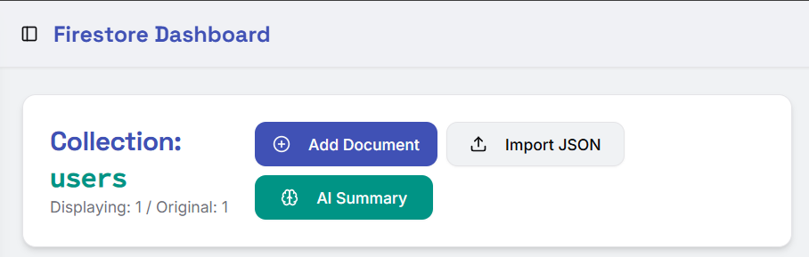

The process of navigating through collections, locating specific documents, and performing edits or additions often requires numerous clicks and manual data entry, frequently disrupting a developer's workflow.

This consistent friction point in managing Firestore data is what FireView aims to address. 
It provides a more efficient and intuitive interface for everyday data interactions.

Features
FireView is designed to optimize your Firestore data management, making common tasks less crappy.

1. Straightforward Connection
Connecting to your Firebase project is a simple process. Provide your Project ID, and FireView will establish a secure connection, leveraging environment variables for additional configuration parameters.

Connect to your Firebase project by entering your Project ID. Other configurations are loaded from your environment variables.

2. Efficient Collection Browse & Management
Navigate and manage your Firestore collections with improved efficiency. Add new collections and switch between existing ones with reduced overhead.

Quickly add new collections and browse existing ones from the left sidebar.

3. Direct CRUD Operations & Data Overview
Access a clear dashboard for your selected collection. Functionality includes adding new documents, bulk importing data via JSON, and an AI-generated summary for quick insights into collection contents.

The Firestore Dashboard for a selected collection, offering quick actions like adding or importing documents.

A clear indication of the document count within your collection, e.g., 'recipes' with 40 documents.

4. Advanced Filtering & Document Search
Locate specific documents without extensive manual searching. FireView provides filtering and search capabilities across document content, field names, and field values.

Efficiently locate specific data using comprehensive filter and search functionalities.

5. Intuitive Document Viewing & Editing
View document fields clearly and perform direct edits in JSON format. This approach minimizes steps for data modification.

A table view presenting document fields, with direct edit and delete options for each entry.

Edit document content directly in JSON format for precise and efficient updates.

6. Bulk Document Import
Streamline the process of adding multiple documents. FireView supports bulk import via JSON file, useful for initial data seeding or large-scale data ingestion.

Import multiple documents efficiently by uploading a JSON file.

7. AI Summary for Collection Insights (Beta)
Obtain an AI-generated summary that provides a high-level overview of your collection's characteristics and data patterns, reducing the need for manual data exploration.

An AI-generated summary offering concise insights into your collection's data structure and content.

Getting Started
Prerequisites
Node.js (LTS recommended)
npm or yarn
A Firebase project with Firestore enabled

# Clone the repository
	git clone https://github.com/bekkerza/fireView.git

# Navigate into the project directory
	cd fireview

# Install dependencies
	npm install # or yarn install
Configuration
FireView requires your Firebase Project ID. Additional Firebase configuration parameters (e.g., API Key, Auth Domain) should be stored in a .env.local file for secure and local management.

Create a .env.local file in the root of your project:

NEXT_PUBLIC_FIREBASE_PROJECT_ID=your-firebase-project-id
# Required:
	NEXT_PUBLIC_FIREBASE_API_KEY=your-api-key
	NEXT_PUBLIC_FIREBASE_AUTH_DOMAIN=your-auth-domain.firebaseapp.com
	NEXT_PUBLIC_FIREBASE_STORAGE_BUCKET=your-storage-bucket.appspot.com
	NEXT_PUBLIC_FIREBASE_MESSAGING_SENDER_ID=your-messaging-sender-id
	NEXT_PUBLIC_FIREBASE_APP_ID=your-app-id
	NEXT_PUBLIC_FIREBASE_MEASUREMENT_ID=your-measurement-id

# Run in development mode
	npm run dev #	or yarn dev

# Build for production
	npm run build # or yarn build

# Start production server
	npm start # or yarn start
FireView should now be accessible at http://localhost:3000 (or your configured port).

Contributing
Contributions are welcome. For feature requests, bug reports, or code contributions, please refer to our Contributing Guidelines or submit an issue/pull request.

License
This project is licensed under the MIT License, but you can really do what you want with this, as long as it means no one else needs to suffer like I do managing what is supposed to be easy. 
